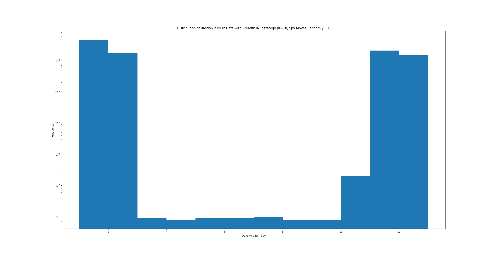
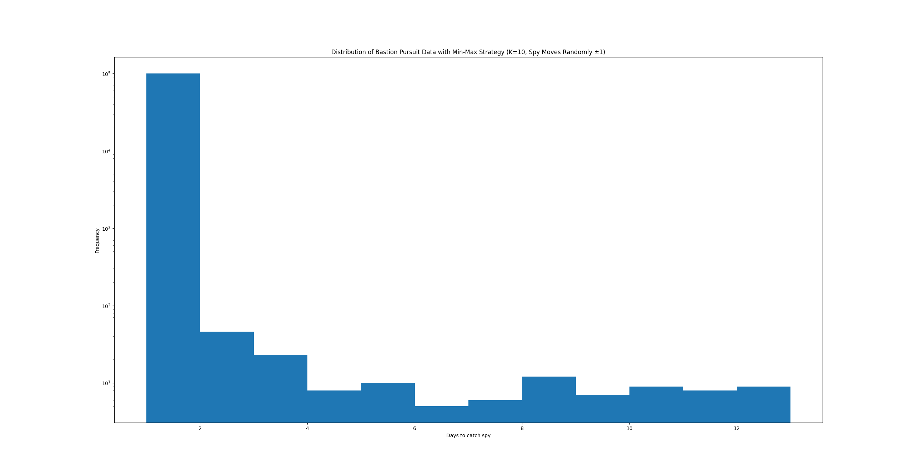
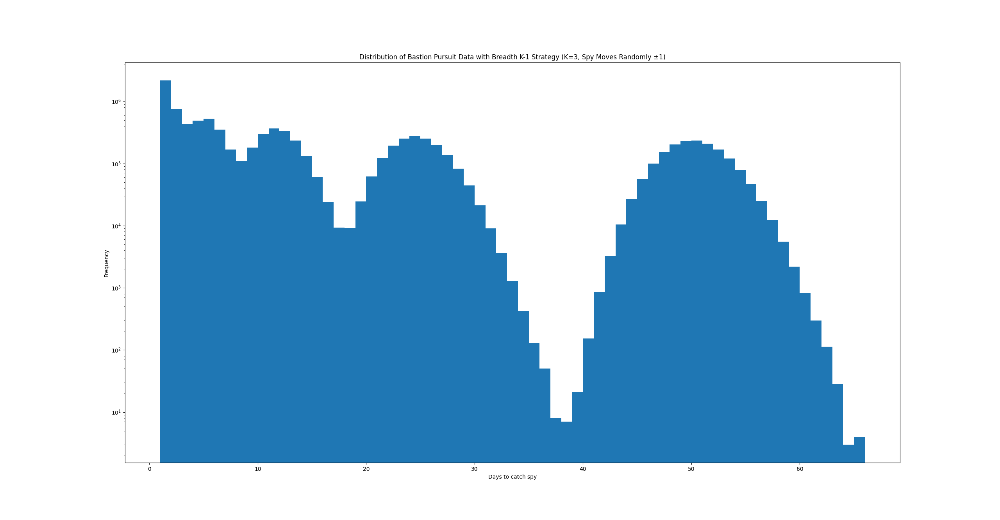
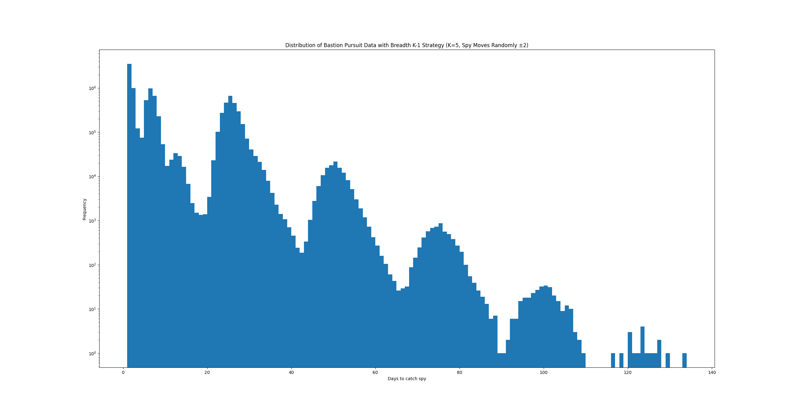
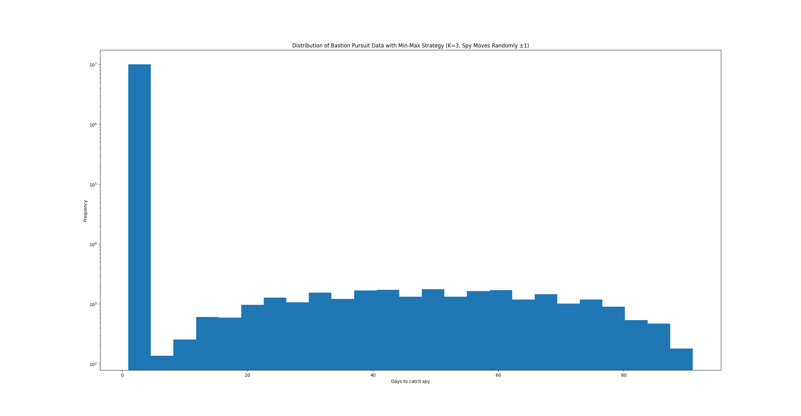
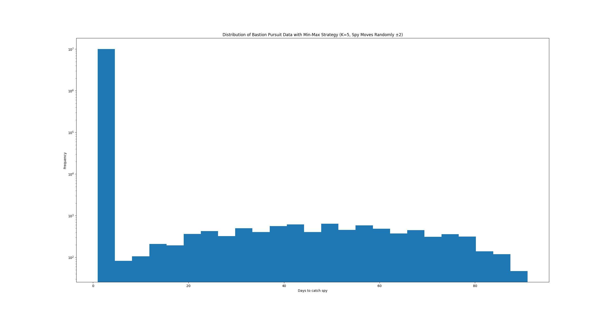

# Set theory is good to know

This one is easier than it looks—especially if you know sets at an elementary level. Hint: Make a set for the Doors and a set for the Spy centered around arbitrary constants. Use the Set Difference Operator (`\`) to find a pattern for K.

Draw out rounds on a spreadsheet or on paper. Once you have a good understanding of the Bastion, you'll have a much better time coming up with a solution.

## Part A

## Other graphs

### K-1 Strategy

#### K = 3, Spy Moves x ∈ [-1, 1] ∩ ℤ

#### K = 5, Spy Moves x ∈ [-2, 2] ∩ ℤ

### MinMax Strategy

#### K = 3, Spy Moves x ∈ [-1, 1] ∩ ℤ

#### K = 5, Spy Moves x ∈ [-1, 1] ∩ ℤ
